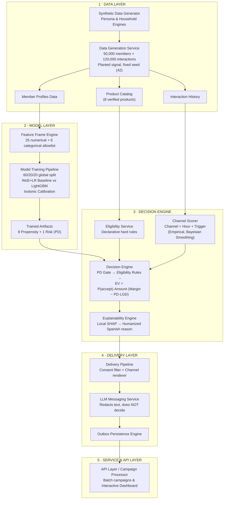

# System Architecture & Technical Specifications

## Table of Contents

1. [The Challenge and the Approach](#1-the-challenge-and-the-approach)
2. [General Architecture](#2-general-architecture)
3. [Business Context and Legal Decisions](#3-business-context-and-legal-decisions)
4. [Data Layer: Synthetic Members with Planted Signal](#4-data-layer-synthetic-members-with-planted-signal)
5. [Model Layer: Training Mechanics and Weight Learning](#5-model-layer-training-mechanics-and-weight-learning)
6. [Decision Layer: The Next-Best-Offer Motor](#6-decision-layer-the-next-best-offer-motor)
7. [Delivery Layer: Channels, Messaging, and Persistence](#7-delivery-layer-channels-messaging-and-persistence)
8. [API and Demo Experience](#8-api-and-demo-experience)
9. [Validation: Unit Tests, Backtesting, and Synthetic Data QA](#9-validation-unit-tests-backtesting-and-synthetic-data-qa)
10. [The Educational Training Test Module](#10-the-educational-training-test-module)
11. [System Execution Workflow](#11-system-execution-workflow)
12. [Key Decisions and Rationale](#12-key-decisions-and-rationale)
13. [Limitations and Future Work](#13-limitations-and-future-work)

---

## 1. The Challenge and the Approach

**The Challenge (Hackathon 30X, Colsubsidio Case):** Colsubsidio — a Colombian family compensation fund with 1,621,106 active members (2025) — seeks to offer each member the optimal credit product tailored to their financial profile and preferences. The central question of the challenge: *How can member profiles be enriched and translated into credit offers that feel custom-designed for each individual?*

**The Chosen Solution:** Rather than building an isolated segmentation model, an end-to-end decision engine was architected: determining **what product to offer, under what precise financial conditions (amount, interest rate, term, monthly installment), when to contact, through which channel, and backed by what natural language explanation**. This scope addresses the official challenge criteria:

* Use **≥3 distinct signals** (excluding basic age/income-only models).
* Provide a **natural language justification** for every generated offer.
* Deliver through **functional contact channels**, beyond static dashboard displays.
* Provide **hour-level granularity** for optimal contact timing.
* Support input by **individual ID numbers or batch processing (10–2,000 IDs)**.

**Core Design Principle:** The decision engine **determines financial terms** using auditable deterministic logic (declarative business rules + calibrated ML models + expected value optimization + SHAP values). The Large Language Model (LLM) **strictly handles messaging tone and formatting**, without altering any numerical parameter or business decision. In consumer credit, explainability is a regulatory requirement and a trust prerequisite.

---

## 2. General Architecture



Five decoupled layers, each operating under a strict integration contract:

| Layer | Component | Inputs | Outputs |
| --- | --- | --- | --- |
| **Data** | Data Generator Module | Fixed random seed (42) | Member records, interaction logs, product catalog |
| **Models** | Model Training Suite | Member features & config schema | 9 calibrated model artifacts + evaluation metrics |
| **Decision** | Next-Best-Offer Engine | Member record, model artifacts, catalog | Offer object (product, amount, rate, term, cuota, channel, time, trigger, reason) |
| **Delivery** | Message Renderer & LLM Pipeline | Offer object + local SHAP explanation | Final channel message + persisted outbox record |
| **Service** | API & Batch Campaign Manager | ID or bulk ID payload | Offer JSON, campaign CSV reports, dashboard analytics |

### 2.1 System Pipeline Flow

```
┌─────────────┐
│   Input      │  CSV / TXT / API
│  (Person IDs)│
└──────┬───────┘
       │
       ▼
┌──────────────────┐
│  API Gateway      │  FastAPI
│  (Ingestion API)  │
└──────┬───────────┘
       │
       ▼
┌──────────────────┐
│  Message Queue    │  SQS or Redis Queue
│  (Async Jobs)     │
└──────┬───────────┘
       │
       ▼
┌──────────────────────────────────────────────┐
│              Worker Pipeline                  │
│                                              │
│  ┌──────────┐  ┌──────────┐  ┌───────────┐  │
│  │  DB       │  │   ML     │  │   LLM     │  │
│  │  Lookup   │─▶│  Predict │─▶│  Generate │  │
│  └──────────┘  └──────────┘  └───────────┘  │
│       │              │              │        │
│       ▼              ▼              ▼        │
│  ┌─────────────────────────────────────┐     │
│  │     Scheduled Message Store         │     │
│  │  (what, who, when, where, message)  │     │
│  └─────────────────┬───────────────────┘     │
└────────────────────┼─────────────────────────┘
                     │
                     ▼
┌──────────────────────────────────────────────┐
│           Scheduler / Dispatcher              │
│  (Checks for messages in their send window)  │
└──┬────────────┬──────────────┬───────────────┘
   │            │              │
   ▼            ▼              ▼
┌──────┐  ┌──────────┐  ┌──────────┐
│ SMS  │  │ WhatsApp │  │  Email   │
│(SNS/ │  │(Business │  │  (SES)   │
│Twilio│  │  API)    │  │          │
└──────┘  └──────────┘  └──────────┘
```

---

## 3. Business Context and Legal Decisions

Prior to model engineering, actual business practices and market parameters were integrated into the architecture. Three primary findings dictated the design:

### 3.1 Catalog Alignment Corrected the Synthetic Data

The official Colsubsidio credit catalog consists of **8 core products** (verified against internal management documentation and early-2026 interest rate structures):

| Product ID | Business Verification Notes |
| --- | --- |
| `cupo_rotativo` | Revolving Line / Multiservicios Card; monthly handling fee included |
| `libre_inversion` | Unsecured personal loan: 1 SMMLV–$150M COP, 6–96 months, amount ≤ 15× monthly income |
| `hipotecario` | Up to 80% LTV, **restricted to Categories A and B**, ages 18–65, primary focus on social housing (VIS) |
| `educativo` | Student loans starting at $300,000 COP, direct disbursement to educational institutions |
| `mujer` | Female-targeted line: $800,000–$6M COP, term ≤ 36 months, restricted by gender (88% Category A) |
| `compra_cartera` | Debt consolidation line: lowest rate tier via payroll deduction |
| `impuestos_seguros` | Tax & insurance financing: $150,000–$5M COP, short term (≤ 11 months), highly seasonal |
| `complementario_hipotecario` | Secondary housing credit: 12–96 months, **requires an active primary mortgage** |

*Catalog Corrections Applied:* Product categories such as emergency loans (`calamidad`) and social microcredit (`microcredito_social`) were removed as they represent employee fund products or administrative divisions rather than standard retail credit lines. Vehicle loans were excluded due to their seasonal/fair-only status. Four omitted official products were integrated.

### 3.2 Membership Category A/B/C Represents Salary Tiers, Not Credit Risk

A critical domain correction: the compensation fund affiliation category is a **statutory wage tier** (Colombian Law 21/1982): **Category A ≤ 2 SMMLV (lowest income), Category B 2–4 SMMLV, Category C > 4 SMMLV, Category D = Non-affiliated**.

The engine enforces `categorias_permitidas` per product rather than treating Category C as a superior credit tier. Commercial data confirms **94% of total 2025 disbursements were granted to Categories A and B**, with Category A accounting for 81% of mortgage applications. Furthermore, interest rates are customized by category (e.g., payroll personal loans offer lower rates for Category A than Category C, maintaining a 5–11 percentage point margin below the statutory usury cap).

### 3.3 Legal and Regulatory Compliance Decisions

* **Exclusion of External Credit Bureau Data:** Per challenge constraints, external bureau scoring was omitted. The internal risk model relies **exclusively on proprietary data** (income, seniority, internal behavioral features). The resulting risk model AUC shifts from 0.840 to 0.828, a deliberate trade-off. Debt consolidation propensity is driven by **declared intent** rather than external debt registers.
* **Prohibition of Scraping Real Personal Data:** Under Colombian Data Privacy Laws (Law 1581/2012 Habeas Data & Law 1266/2008), profile enrichment utilizes **simulated data connectors**. Every variable is wrapped in a *Data Governance Envelope*: `{value, source, legal_basis, consent, confidence_score, freshness, ttl}`. Unverified variables without legal basis cannot enter the engine; expired features (`freshness > ttl`) are flagged inactive.
* **Gender Bias Safeguards:** Gender is **strictly excluded** from ML model feature sets. It serves solely as a declarative eligibility gate for the specialized Women's Credit Line (`mujer`) and as an audit metric for algorithmic fairness evaluation (using the 4/5ths rule).

---

## 4. Data Layer: Synthetic Members with Planted Signal

**Rationale for Synthetic Data:** Because real member records could not be distributed, a synthetic population was engineered that mirrors Colsubsidio's demographic distribution **with known planted signals**. By controlling the data-generating process, model signal recovery can be empirically verified—validating the pipeline architecture independently of real data availability.

### 4.1 Synthetic Data Generation Process

1. **Base Population Engine:** Synthetic identities are created with attributes including age (filtered between 18 and 69), monthly income, employment sector, declared interests, life events, and household composition.
2. **Internal Signals Generation:** Internal indicators are derived, including:

$$\text{ibc\_smmlv} = \text{clip}\left(\frac{\text{income}}{\text{SMMLV}}, 1, 25\right)$$

Wage tiers (Categories A/B/C) are mapped directly from income. An internal credit score ($\text{score\_interno}$) is synthesized from normalized income, employer tenure, and random noise (bounded between 150 and 950). Indebtedness ratios, transactional usage of fund services (supermarkets, recreation, education), digital affinity scores, active delinquency flags (~6%), and existing mortgage indicators are calculated.

3. **Planted Signals per Product:** Deterministic target rules ("ground truth weights") are assigned to each credit line alongside base prevalence rates and eligibility masks:

| Target Line | Planted Signal Logic (Ground Truth Rules) | Base Rate |
| --- | --- | --- |
| `tomo_educativo` | $0.30 \cdot \text{dependents} + 0.45 \cdot \mathbb{I}(25 \le \text{age} \le 45) + 0.20 \cdot \text{edu\_usage} + 0.50 \cdot \text{edu\_interest}$ | 8% |
| `tomo_libre_inversion` | $0.45 \cdot z(\text{ibc}) - 1.10 \cdot \text{indebtedness} + 0.20 \cdot z(\text{tenure})$ | 11% |
| `tomo_compra_cartera` | $0.90 \cdot \text{consolidation\_intent} + 0.70 \cdot \text{consolidation\_event} + 0.70 \cdot \text{indebtedness}$ | 7% |
| `tomo_mujer` | $0.30 \cdot \text{dependents} + 0.45 \cdot \mathbb{I}(\text{Cat A}) + 0.40 \cdot \text{birth\_event} + 0.20 \cdot z(\text{subsidy\_usage})$ *(Female mask)* | 9% |
| `default_12m` | $-1.40 \cdot z(\text{internal\_score}) + 0.90 \cdot \frac{\text{indebtedness}}{0.8} + 0.35 \cdot \text{unstable\_contract} - 0.15 \cdot z(\text{tenure})$ | 5% |

The target probability is computed as $p = \sigma(\text{signal} + \mathcal{N}(0, 0.5) + b)$, where intercept $b$ is calculated numerically using Brent's method (`scipy.optimize.brentq`) so that the population mean matches the exact base rate. Binary outcomes are sampled as $\text{target} \sim \text{Bernoulli}(p)$. Three target columns are preserved per product: the binary outcome, the true probability $p$, and the noise-free signal $s$ (representing the theoretical learning ceiling).

4. **Historical Interaction Records:** 120,000 synthetic campaign logs record member ID, product, channel, contact timestamp, and outcome (`accepted`, `rejected`, `ignored`). Acceptance probabilities incorporate planted boosts: digital channels boost high digital affinity profiles (×1.9), branch/call center interactions boost low digital affinity profiles (×1.7), and seasonal lines scale during key calendar months. Historical channel assignments are generated independently of member attributes to allow causal backtesting evaluation.

---

## 5. Model Layer: Training Mechanics and Weight Learning

> **How the Model Learns Product Weights:** The architecture does not rely on a single multi-output neural network. Instead, it trains **9 independent LightGBM models** (8 product-specific propensity models + 1 overall 12-month default risk model). Each model independently learns split thresholds and feature importance weights from allowed variables. Inter-product prioritization weights are applied downstream by the decision engine using financial expected value formulas.

### 5.1 The Map: There Is No Single Model, There Are Nine

There is no single model that "chooses the credit product." There are **9 independent binary classifiers**, all sharing the same algorithm and training protocol, each answering a distinct question:

| # | Classifier Name | Question Answered | Test AUC | Training Population |
| --- | --- | --- | --- | --- |
| 1 | Revolving Line Model | Would they accept a revolving credit line? | 0.611 | all |
| 2 | Personal Loan Model | Would they accept a personal loan? | 0.631 | all |
| 3 | Mortgage Model | Would they accept a mortgage? | 0.620 | all |
| 4 | Education Loan Model | Would they accept an education loan? | 0.721 | all |
| 5 | Debt Consolidation Model | Would they accept debt consolidation? | 0.634 | all |
| 6 | Women's Credit Model | Would they accept the Women's Credit? | 0.669 | **Female gender only** |
| 7 | Tax/Insurance Model | Would they accept a tax/insurance loan? | 0.609 | all |
| 8 | Complementary Mortgage Model | Would they accept the complementary mortgage loan? | 0.672 | **Only with an active mortgage** |
| 9 | Default Risk Model | Will they default on a loan within 12 months? (PD) | **0.828** | all |

The first eight are **propensity models** (probability of the individual accepting that product); the ninth is the **risk model** (probability of default, "PD"). The eight propensity models compete with each other inside the engine; the risk model acts as a cross-cutting arbiter (throttling, reducing amounts, and discounting value).

**Why 9 binary models instead of 1 multiclass model:** A multiclass approach forces classes to compete during training ("which product?" as a single question) and prevents training each product on its specific eligible population or adding/removing products without retraining everything. With 9 independent heads, each product gets its own well-calibrated probability, and arbitration between products happens AFTERWARD using explicit business logic. The multiclass approach (5 classes, including "REJECTED" as a class) was evaluated and discarded — it originated from a legacy scaffold and also depended on credit bureau data, which was excluded by the challenge rules.

### 5.2 Data Contract & Feature Allowlist

All 9 models see the exact same **31 features** via an explicit allowlist — nothing outside this list enters: no targets, no gender, no PII:

* **25 numerical features** — profile: `age`, `income` (income in minimum wages), `tenure_months`, `job_tenure_months`, `dependents`, `internal_score` (organization's internal score, NOT bureau), `debt_ratio`; behavior: `subsidy_usage_12m`, `supermarket_usage_12m`, `recreation_usage_12m`, `education_usage_12m`, `services_usage_index`, `months_since_last_credit`, `current_delinquency`, `active_credit`, `has_mortgage`; declared exogenous signals: `digital_affinity`, `months_since_event`, `education_interest`, `housing_interest`, `consolidation_interest`, `tax_interest`, `tourism_interest`, `tech_interest`, `health_interest`.
* **6 categorical features** — `category` (A/B/C), `contract_type`, `company_size`, `city`, `life_event`, `job_sector`.

The data pipeline enforces three strict rules:

1. Any missing allowlist feature triggers an immediate `ValueError`.
2. `NaN` values across any feature trigger a `ValueError` (imputation must be an explicit upstream design decision).
3. Any feature outside the allowlist (such as target probability debug flags, raw PII, or gender) is stripped automatically to eliminate data leakage.

### 5.3 Single Global Train/Validation/Test Split (60/20/20)

A single global data partition (60% Train, 20% Validation, 20% Test, seed 42) is generated and shared across all 9 model targets. The split indices and dataset SHA-256 hashes are persisted.

*Rationale:* Splitting per target independently would cause a member's test record for one product to leak into the training set of another. A shared global split ensures the Next-Best-Offer engine evaluates downstream decision performance on a unified, unseen test cohort.

### 5.4 Target Population Filtering: P(Accept | Eligible)

Specific models enforce structural eligibility filters prior to training. For instance, `tomo_mujer` is trained exclusively on female members, while `tomo_complementario_hipotecario` is trained strictly on active mortgage holders.

*Rationale:* Because the decision engine applies hard eligibility gates prior to scoring, non-eligible individuals will never be evaluated by these models in production. Including ineligible individuals during training introduces out-of-distribution noise and artificially inflates metrics (e.g., secondary mortgage models achieving artificial AUCs of 0.982 simply by re-learning who owns a primary mortgage).

### 5.5 The Production Algorithm: LightGBM (Gradient Tree Boosting)

**What it is.** LightGBM builds an "ensemble" of small decision trees trained **sequentially**: each new tree specializes in correcting the errors left by previous ones. That is *gradient boosting*:

1. The model starts with a trivial prediction: the log-odds of the base rate (if 8% take an education loan, it starts by predicting 8% for everyone).
2. For each member in the training set, the **error gradient** is calculated: how much and in what direction the current prediction was wrong (with logistic loss: $y - \hat{p}$, the residual between what occurred and what was predicted).
3. A **small tree** is fit to predict these residuals: the tree searches feature by feature and threshold by threshold for the splits that best separate those the model underestimates from those it overestimates. Each split is selected based on the **gain** (loss reduction) it produces — this is the exact moment the algorithm "discovers" that `education_interest` or `dependents` matter: if splitting by that feature significantly reduces error, the split is made; if it is noise, it gains nothing and is ignored.
4. The prediction is updated by adding the new tree multiplied by the **learning rate** (0.03): small steps, many trees — slower, but more stable.
5. This repeats up to 2,000 times, BUT with **early stopping**: after each tree, the AUC is measured on the **validation** set (data unseen during training); if 100 trees pass without improvement, training stops and retains the best checkpoint. In practice, it stops well before the maximum (e.g., the Default Risk model uses 22 trees) — preventing the model from memorizing.

**An affiliate's final prediction** is calculated by: traversing the N trees, landing on a leaf node in each, **summing the values of those leaves**, and passing the sum through the sigmoid function to obtain a probability. A LightGBM's "weights" are literally **its tree splits and leaf values**.

**Hyperparameters and their rationale:**

| Parameter | Value | Rationale |
| --- | --- | --- |
| `n_estimators` | 2000 | Generous ceiling; early stopping dictates the actual number |
| `learning_rate` | 0.03 | Small steps: better generalization on noisy target labels |
| `num_leaves` | 15 | Small trees (≈4 levels): with low prevalence (3–12%), large trees quickly memorize rare positives |
| `min_child_samples` | 100 | No leaf can be based on fewer than 100 members: eliminates anecdotal rules |
| `early_stopping_rounds` | 100 | 100-tree patience window on validation AUC (`first_metric_only=True`: stopping is governed strictly by AUC) |
| `random_state` | 42 | Full reproducibility |

This combination (regularization + early stopping) was verified empirically: it outperforms default settings by ~5 AUC points on low-prevalence targets. Without it, the model stalled at ~90% of its learnable ceiling; with it, it reaches ≥97%.

**Categorical features** are not converted into dummy variables: LightGBM handles them natively (pandas dtype `category`). Consequently, the model artifacts preserve the **category vocabulary** from training: in production, columns are re-encoded using these exact categories (identical internal codes) — any unseen category defaults to *missing* with a warning, and if new categories exceed 20% of a batch, the entire batch is rejected (indicating a likely mapping error).

### 5.6 The Baseline: WoE + Logistic Regression (Literal Weights)

Before training LightGBM, the credit industry's standard interpretable baseline is ALWAYS trained via the pipeline setup:

1. **WoE (Weight of Evidence)** with OptBinning: each feature is binned into optimal buckets, and each bucket is replaced by $\ln(P(\text{bucket}|\text{bad}) / P(\text{bucket}|\text{good}))$ — measuring how much evidence that bin provides for or against the target event. This is the classic transformation used in banking scorecards.
2. **Logistic Regression** on transformed features:

$$P = \text{sigmoid}(\beta_0 + \beta_1 \cdot \text{woe}(x_1) + \dots + \beta_{31} \cdot \text{woe}(x_{31}))$$

Here, the "weights" are **literal**: one coefficient $\beta_i$ per feature, inspectable directly in the model pipeline object. The complete scorecard can be printed and audited line by line.

**Project selection rule:** LightGBM and the baseline are compared strictly by **validation AUC** (never test AUC). If LightGBM does not win by a clear margin, the baseline is deployed. On synthetic data, they run near a tie (the embedded signal is nearly linear — as expected); the rule exists to govern performance on real-world data.

### 5.7 Model Training Protocol

Each of the 9 targets undergoes the following training sequence:

```
Raw Data → Allowlist Filter → Global Split → Population Mask
  │
  ├─► 1. Baseline Model: OptBinning (WoE) + Logistic Regression
  │
  ├─► 2. Candidate Model: Regularized LightGBM (Early Stopping on Val AUC)
  │
  ├─► 3. Validation Model Selection (Val AUC Comparison)
  │
  ├─► 4. Isotonic Calibration (Fitted on Validation Scores)
  │
  └─► 5. Test Set Evaluation & Artifact Serialization
         ├─ Unseen Test Performance (AUC, KS, Gini, Lift)
         ├─ Synthetic Ceiling Comparison
         ├─ SHAP Feature Importance
         └─ Fairness Audit (4/5ths Rule on Top-20%)
```

1. **Interpretable Baseline:** Weight of Evidence (WoE) transformation via `OptBinning` combined with `LogisticRegression`.
2. **LightGBM Candidate:** Hyperparameters tuned for low prevalence regimes: `n_estimators=2000`, `learning_rate=0.03`, `num_leaves=15`, `min_child_samples=100`, with early stopping (100 rounds) monitored against validation set AUC.
3. **Model Selection:** The model achieving higher validation AUC is selected. Test set performance is never utilized during model selection.
4. **Isotonic Calibration:** An `IsotonicRegression` calibrator is fitted on validation set raw prediction scores.
*Note on Probability Calibration vs Ranking:* Isotonic calibration converts raw outputs into honest, well-calibrated probabilities necessary for expected financial value calculation. However, calibration creates score step-functions (plateaus/ties). Therefore, **ranking-based metrics (AUC, KS, Gini, Lift, SHAP, and Fairness) are evaluated on raw prediction scores**, while **expected value decisions use calibrated probabilities**.
5. **Evaluation on Unseen Test Set:** Metrics recorded include AUC, Kolmogorov-Smirnov (KS, evaluated on unique prediction values to prevent tie inflation), Gini coefficient, decile lift tables, Brier score, Expected Calibration Error (ECE), and comparison against the theoretical synthetic ceiling.
6. **Explainability & Fairness Audits:** Global SHAP feature importance is extracted. Demographic parity and disparate impact are audited on the top-20% ranked population across age groups, locations, and gender using the 4/5ths rule threshold.
7. **Artifact Serialization:** Selected models are saved into self-contained artifacts containing the calibrated pipeline, categorical feature encodings, data hash digests, schema definitions, and validation/test metric logs.

### 5.8 Isotonic Calibration: Honest Probabilities

A boosting model's raw score ranks instances well, but its overall scale may be shifted (predicting 0.30 when the true rate is 0.22). Because the decision engine multiplies probabilities by monetary amounts (expected value), scale accuracy is crucial. The calibration solution:

* An **isotonic regression** is fit on the validation set: finding the non-decreasing step function that best maps raw score → observed true frequency.
* Non-decreasing = **never reverses the rank order** of two members (at most, it creates ties among nearby scores). For this reason, the project strictly separates two use cases:
  * `predict_proba_raw` (raw score) → for **ranking/sorting**: AUC, KS, lift, top-k selection, fairness (isotonic step function creates tie plateaus that distort these metrics).
  * `predict_proba` (calibrated) → for the engine's **expected value** calculations and calibration metrics (Brier score / ECE).
* The impact is **verified** using Expected Calibration Error (ECE) comparing raw → calibrated scores on the test set: for the Default Risk model, ECE drops from 0.0236 to 0.0063 (~4× improvement).

### 5.9 How to READ Learned Weights: Gain and SHAP

A LightGBM model does not yield a single coefficient per feature, but its weights are interpreted in two ways:

**a) Gain-based Importance (Global).** The total gain (error reduction) contributed by each feature across all splits where it was utilized. In an educational mini-dataset where ground truth is set to $0.30 \cdot \text{dependents} + 0.45 \cdot I(25 \le \text{age} \le 45) + 0.20 \cdot \text{education\_usage} + 0.50 \cdot \text{education\_interest}$, the trained model returns:

```text
dependents           12292   <- planted
education_usage_12m   6029   <- planted
education_interest    5218   <- planted
age                   3862   <- planted
debt_ratio             477   (noise)
```

The 4 true features dominate noise features (27 total) by an order of magnitude. **Important nuance:** Gain does not rank purely by a rule's nominal weight, but by **weight × feature variance** (contribution to total variance): `dependents` (weight 0.30, range 0–4) outranks `education_interest` (weight 0.50, binary). This is the correct behavior: it measures how much prediction variance is explained by each feature.

**b) SHAP (Global and Local).** SHAP decomposes **each individual prediction** into an exact sum of feature contributions: $\text{prediction} = \text{base value} + \sum \phi_i$, where $\phi_i$ is the contribution (positive or negative) of feature $i$ **for that specific member**. Using TreeExplainer, this calculation is exact for tree-based models.

* **Global**: mean $|\phi_i|$ across a sample → "what drives this model overall" (reported in model documentation per target).
* **Local**: for ONE member and the winning product, top-3 **positive** contributions are translated into natural language — generating individual offer statements like: *"We offer you an education loan **because** you have 2 dependents, expressed interest in education, and fit the target age range."* Explanations are not static templates: they are dynamically derived from the model that scored the individual.

### 5.10 Production Serving Contract

During execution, the model pipeline enforces runtime safety:

* Missing schema columns raise a `ValueError`.
* Unhandled `NaN` inputs raise a `ValueError`.
* Unseen categorical values are handled gracefully as missing categories by LightGBM, with warnings logged. If Out-Of-Vocabulary (OOV) rates exceed 20% of an input batch, execution fails with a `ValueError` to prevent predictions on distribution-shifted data.

### 5.11 Empirical Model Performance (Unseen Test Set)

| Target Model | Prevalence | Test AUC | Synthetic Ceiling | Test KS | ECE (Raw → Calibrated) |
| --- | --- | --- | --- | --- | --- |
| `tomo_cupo_rotativo` | 12.0% | **0.611** | ≈ 0.620 | 0.174 | Improved |
| `tomo_libre_inversion` | 11.0% | **0.631** | ≈ 0.640 | 0.203 | Improved |
| `tomo_hipotecario` | 3.0% | **0.620** | ≈ 0.630 | 0.187 | Improved |
| `tomo_educativo` | 8.0% | **0.721** | ≈ 0.730 | 0.326 | Improved |
| `tomo_compra_cartera` | 7.0% | **0.634** | ≈ 0.640 | 0.252 | Improved |
| `tomo_mujer` | 9.0% (♀) | **0.669** | ≈ 0.680 | 0.287 | Improved |
| `tomo_impuestos_seguros` | 6.0% | **0.609** | ≈ 0.620 | 0.181 | Improved |
| `tomo_complementario_hip` | 35.0% (Eligible) | **0.672** | ≈ 0.680 | 0.281 | Improved |
| **`default_12m` (Risk)** | **4.8%** | **0.828** | **0.833** | **0.509** | **0.0236 → 0.0063** |

* Performance across propensity models captures ≥97% of available planted signal. Observed AUC values mirror the exact noise boundaries planted within the synthetic generation engine.
* The 12-month default model achieves strong performance (AUC 0.828, KS 0.509, Gini 0.657, 4.7× top-decile lift), serving as a reliable risk barrier.

### 5.12 Training Safeguards and Protocol

Three core rules safeguard the validity of all reported metrics:

1. **Single global 60/20/20 split** (seed 42, persisted in split configuration metadata): all 9 models share the exact same train/validation/test partitions. The test set remains **untouched**: it plays no role in early stopping (validation), calibration (validation), or model selection (validation). It is evaluated strictly at the end.
2. **P(accepts | eligible):** The Women's Credit model is trained exclusively on female members, and the Complementary Mortgage model strictly on active mortgage holders. Without this restriction, the model "learns" the eligibility boundary that the engine already enforces as a gatekeeper (e.g., the complementary mortgage model previously yielded a false AUC of 0.982 simply by predicting who held a mortgage).
3. **Learnable ceiling:** In synthetic data, the deterministic signal `_s_target` (noiseless) defines the maximum achievable AUC for any model. All 9 models reach ≥97% of their theoretical ceiling — meaning modest AUC values (0.61–0.72 in propensity) reflect **all available signal in the data**, not model weakness. Chasing higher scores would mean fitting noise.

---

## 6. Decision Layer: The Next-Best-Offer Motor

### 6.1 Core Architecture

**The decision engine does not learn weights across products.** The 9 ML models yield probabilities; business parameters (margin per product, LGD, risk thresholds) are declared in business catalog configurations; and the engine evaluates them using an explicit, auditable formula. No component of the final offer is a black box: every number can be traced back to a calibrated model output or a configuration setting.

```
Member Profile Input
  │
  ▼
1. Risk Gate ──────────────► [PD > 0.20?] ──► YES ──► Decline Offer / Financial Education
  │
  ▼ NO
2. Hard Eligibility Rules ─► [Meets Age, Score, Income, Category, Existing Products?]
  │
  ▼ Eligible Products
3. Financial Capacity ─────► Calculate Max Amortization (French Installment ≤ 30% Disposable Income)
  │
  ▼
4. Expected Value (EV) ────► EV = P(Accept) · Amount · (Margin − PD · LGD)
  │                          (If 0.10 < PD ≤ 0.20, Amount is scaled by 50%)
  ▼
5. Offer Ranking ──────────► Rank by EV Descending (Top 1 = Primary, Top 2-3 = Alternatives)
  │
  ▼
6. Channel & Timing ───────► Empirical Bayesian Channel Scoring + Contact Hour + Trigger Event
  │
  ▼
7. Local Explainability ───► Extract Local SHAP Drivers → Generate Humanized Justification
```

### 6.2 Step [1] — Risk Gatekeeper (Default Risk Model)

Calculates the member's **calibrated PD**. Three risk tiers exist (configured in risk policies):

| Calibrated PD | Engine Action |
| --- | --- |
| ≤ 0.10 | Standard offer |
| (0.10, 0.20] | Offer with **amount reduced by half** (not dropping below product minimum) — via amount adjustment rules |
| > 0.20 | **No offers.** Returns response with financial education reasoning |

The member's 12-month calibrated Probability of Default ($PD$) is evaluated first. If $PD > 0.20$, the engine generates **no credit offers**, returning financial education guidance instead. This prevents high-risk over-indebtedness.

Anti-pattern explicitly avoided: optimizing for conversion while ignoring risk. PD enters the pipeline twice: as a hard gatekeeper here, and as a discount factor within Expected Value (Step 4).

### 6.3 Step [2] — Declarative Eligibility (Eligibility Rules + Product Catalog)

Every product defines its operational rules **as configuration data** (rows in the product catalog), rather than hardcoded logic. Each product is validated sequentially:

1. Member `category` ∈ `allowed_categories` (e.g., mortgage: A|B only).
2. Member `age` ∈ [min_age, max_age] (mortgage: 18–65; others: 18–69).
3. Minimum job tenure **based on contract type**: 2 months for indefinite contracts, 6 months for others (project brief requirement).
4. `internal_score` ≥ `min_internal_score`.
5. If `requires_no_delinquency` is true: requires `current_delinquency == 0`.
6. `gender_restriction` (Women's Credit: Female only) — the sole presence of gender filtering across the system, acting strictly as a product requirement rather than a model feature.
7. `prerequisite_product` (complementary loan: requires `has_mortgage == 1`).
8. **Payment capacity** — customizes terms per member:
   * Interest rate based on category: rates in catalog (Category A receives lower rates).
   * Disposable income = $\text{income} \times (1 - \text{debt\_ratio})$.
   * Maximum installment = 30% of disposable income (conservative vs. the 50% legal payroll limit).
   * Suggested loan amount = inverse of the **French amortization formula** for that max installment:

$$\text{amount} = \text{installment} \times \frac{1 - (1+i)^{-n}}{i}$$

where $i = (1 + \text{annual\_rate})^{1/12} - 1$ and $n$ = term length (36 months default, bounded by product bounds).

   * Real-world caps enforced: amount ≤ 3× income; maximum $1,500,000 if earning ≤ 1 SMMLV; bounded by product min/max constraints.

If any rule fails, the product is excluded **prior to model scoring**, recording the specific reason for exclusion.

### 6.4 Steps [3]–[5] — Propensity, Expected Value, and Arbitration

For each eligible product, propensity is requested from its corresponding model (**calibrated** `predict_proba`) to compute:

$$\text{EV} = P(\text{accepts} \mid \text{eligible}) \times \text{amount} \times (\text{margin} - \text{PD} \times \text{LGD})$$

* `margin`: Estimated product margin (catalog specification: revolving line 12%, tax loan 11%, personal loan 10%, women's credit 9%, debt consolidation 7%, education 6%, mortgage & complementary 5%).
* `LGD` (Loss Given Default) = 0.45, standard assumed baseline defined in config.
* **Formula detail** (critical finding during code review): expected loss ($\text{PD} \times \text{LGD}$) is deducted against total **principal exposure**, not merely the profit margin. Consequence: a product with 5% margin and 15% PD yields effective margin $0.05 - 0.15 \times 0.45 = -0.0175 \to$ **Negative EV** → excluded ($\text{min\_ev} = 0$ filter). The engine prefers withholding an offer over making one that destroys value.

**Arbitration:** Products are sorted by EV in descending order. Top-1 becomes the primary offer; the next 2 become alternative offers. Products with opposite trade-offs compete directly: a high-propensity, lower-margin product can beat a high-margin product that the individual is unlikely to accept — EV quantifies this trade-off explicitly.

#### Complete Numerical Example (Illustrative)

Member profile: Category A, income 1.8 SMMLV, debt ratio 30%, 2 dependents, declared interest in education, calibrated PD = 0.06 (passes risk gate, no amount reduction).

| Product | Eligible? | P(accepts) | Amount (SMMLV) | Margin | Effective Margin ($-\text{PD}\cdot\text{LGD} = -0.027$) | EV |
| --- | --- | --- | --- | --- | --- | --- |
| education | yes | 0.19 | 3.5 | 0.06 | 0.033 | $0.19 \times 3.5 \times 0.033 = \mathbf{0.0219}$ |
| revolving_line | yes | 0.08 | 2.0 | 0.12 | 0.093 | $0.08 \times 2.0 \times 0.093 = 0.0149$ |
| personal_loan | yes | 0.06 | 3.5 | 0.10 | 0.073 | $0.06 \times 3.5 \times 0.073 = 0.0153$ |
| mortgage | no (capacity) | — | — | — | — | excluded |
| womens_credit | yes | 0.11 | 1.5 | 0.09 | 0.063 | $0.11 \times 1.5 \times 0.063 = 0.0104$ |

**Primary Offer: Education Loan** (despite having the lowest raw margin among the four): high propensity — driven by features cited by SHAP — offsets the lower margin. Alternatives: Personal Loan and Revolving Line. If PD were 0.15, the effective margin for the education loan would become $0.06 - 0.0675 < 0$, rejecting it; the revolving line (12% margin) would survive at half amount.

### 6.5 Step [6] — Channel, Time, and Timing (Channel Scoring, Non-ML)

This layer **does not use LightGBM**: it learns empirical acceptance rates from historical interaction logs (120k campaigns, train+valid only) using **Bayesian smoothing**:

$$\text{rate}(\text{segment}, \text{channel}) = \frac{\text{acceptances} + \alpha \cdot \text{global\_rate}}{\text{sends} + \alpha}, \quad \alpha = 50$$

Under sparse data, estimates shrink toward the global mean (preventing overreaction to 3 observations); with high volume, it converges to the segment's true empirical rate.

* **Segment** = digital affinity band (high ≥ 70 / medium ≥ 45 / low) × category. (Age segmentation was tested and discarded: it collapsed into 6 sparse cells and yielded zero lift).
* **Channel** = argmax rate across **allowed** communication channels for that member (opt-in consent + valid contact data — dual-key rule in delivery module).
* **Time** = optimal time window (morning / midday / afternoon / night) per segment and channel.
* **Timing** (priority): recent life event (≤ 12 months) → new member (≤ 3 months) → recently cleared credit line → product seasonality (only if top month exceeds current month by ≥ 1.3×) → "immediate".

Causal validation (enabled because campaign channels were randomly assigned in synthetic data): delivering via the engine-selected channel yields 30.1% acceptance vs. 17.9% with a single baseline channel — **+67.9% lift** (verified via NBO backtesting suite).

### 6.6 Step [7] — Offer Reasoning (Explainability Module)

For the primary offer: local SHAP values are extracted from the winning product's model → top-3 positive feature contributions → natural language mapping via lookup dictionary → explainability builder compiles the final explanation integrating feature drivers + payment capacity constraints + channel + timing + time window. Example output structure:

> *"Education loan recommended due to **2 dependents, expressed interest in education, and your age**; monthly payment of $X capped at 30% of your disposable income; we contact you via **app** in the **evening** due to your high digital affinity, coinciding with the **start of the academic semester**."*

Every component has a clear owner: feature drivers originate from local SHAP values, payment amounts come from eligibility logic, and channel/timing are generated by the Channel Scorer. The LLM layer (when an API key is present) solely rephrases this constructed text into natural prose — it is strictly prohibited from altering figures, and without credentials, the template renders directly via local messaging components.

### 6.7 Pipeline Responsibilities Summary

| Engine Stage | Source / Model | Output Used |
| --- | --- | --- |
| Risk Gatekeeper | Default Risk Model (Calibrated LightGBM) | Calibrated PD |
| Eligibility | Product Catalog + Eligibility Module (Rule Engine, non-ML) | Eligible flag (yes/no) + Amount / Rate / Term / Installment |
| Propensity | 8 Propensity Models (Calibrated LightGBM) | Calibrated product acceptance P(accepts) |
| Amount Adjustment | Default Model + Adjustment Rules | Final capped loan amount |
| Expected Value | EV Formula (Propensity × Amount × Effective Margin) | Product ranking |
| Channel / Time | Channel Scorer (Empirical rates + Bayesian smoothing, non-ML) | Optimal channel and time-of-day window |
| Timing | Priority rules + empirical seasonality | Optimal contact timing |
| Reason Generation | Local SHAP on winning product model | Feature drivers behind the offer |

---

## 7. Delivery Layer: Channels, Messaging, and Persistence

### 7.1 Consent Verification & Rendering

Messaging delivery follows strict opt-in logic:

* WhatsApp delivery requires active consent (`consent_whatsapp == 1`) and a valid phone number. Deep-link URLs (`wa.me/<phone>?text=<message>`) are auto-generated.
* Email delivery requires active consent (`consent_email == 1`) and a valid email address.
* App notifications, call center queues, and branch advisor tasks serve as fallback delivery channels. Financial figures are formatted in COP at statutory SMMLV values rounded to the nearest thousand.

### 7.2 LLM Messaging Transformation

The LLM module is responsible for generating personalized messages in Spanish (Colombian, friendly tone) based on ML recommendations. It receives person data + product recommendation, calls a self-hosted LLM via Ollama, and returns a formatted message ready for dispatch.

**Recommended Models:**

| Model | Size | RAM (Q4) | Notes |
|---|---|---|---|
| **Qwen 2.5 1.5B** | ~1GB | ~1.2GB | Excellent Spanish fluency, very fast on CPU |
| **Gemma 2 2B** | ~1.6GB | ~1.8GB | Good multilingual support, slightly slower |
| **Llama 3.2 1B** | ~0.7GB | ~0.9GB | Fastest, but Spanish quality is weaker |
| **Mistral 7B Q4** | ~4GB | ~4.5GB | Overkill for this task, but solid quality |

**Recommendation**: Start with **Qwen 2.5 1.5B** — best balance of Spanish fluency, speed, and low resource usage.

The LLM operates purely as a text-formatting transformer. All offer parameters (amount, interest rate, term, cuota, channel, reason) are generated deterministically by the decision engine and passed to the LLM as immutable JSON context.

System prompt constraints enforce:

* Absolute prohibition against modifying numerical values, rates, or loan conditions.
* Strict adherence to channel-specific formatting guidelines and tone.
* Graceful fallback: If LLM API keys are unavailable or service latency exceeds limits, the engine immediately dispatches pre-formatted deterministic message templates without disrupting API service.

### 7.3 Persistence Outbox

Dispatched offer payload records are stored in an outbox SQLite store (or PostgreSQL `scheduled_messages` table). Recorded fields include offer details, channel assignment, contact window, generated script text, timestamp, and status tracking (`scheduled`, `pending`, `sent`).

### 7.4 Channel Adapters

| Channel | Provider (Prototype) | Cost |
|---|---|---|
| **SMS** | AWS SNS (100 free SMS/month) or Twilio trial | Free tier |
| **WhatsApp** | WhatsApp Business Cloud API (1,000 free conversations/month) | Free tier |
| **Email** | AWS SES (62,000 free emails/month if sent from EC2) | Free tier |

---

## 8. API and Demo Experience

The RESTful API provides endpoints for real-time decisioning and batch processing:

* `POST /next-best-offer`: Receives member ID and context month; returns primary offer, secondary alternatives, financial calculations, local SHAP explainability text, and formatted messaging payloads.
* `POST /campaigns/batch`: Accepts batch files containing 10 to 2,000 member IDs. Processes campaign queues asynchronously in background threads, returning job tracking IDs and downloadable CSV offer summaries.
* `GET /afiliados/{id}`: Returns member profile context stripped of PII.
* `GET /health`: Returns health status of engine dependencies, model artifacts, and LLM services.
* **Interactive Demo Dashboard:** A web interface displays curated persona scenarios illustrating targeted decision engine behavior (e.g., family household → education line; high debt consolidation intent → balance transfer; high digital affinity → evening app push; elevated risk flag → risk gate protection trigger).

**API contract:**
```
POST /api/v1/batches
Content-Type: multipart/form-data | application/json

Body: { "person_ids": ["P001", "P002", ...] }  OR  file upload (CSV/TXT)

Response: { "batch_id": "uuid", "status": "queued", "count": 150 }
```

---

## 9. Validation: Unit Tests, Backtesting, and Synthetic Data QA

### 9.1 Unit Test Suite

The test suite contains **97 automated unit tests** covering system components:

| Module Focus | Test Coverage |
| --- | --- |
| **Model Pipelines** | KS metrics with tie handling against `scipy`, Gini coefficients, monotonic lift verification, ECE calculations, allowlist feature contracts, deterministic split index validation, OOV categorical threshold handling, and missing value exception triggers. |
| **Decision Engine** | Declarative eligibility evaluation (delinquency, score, capacity limits, mortgage prerequisites), French amortization math, negative EV filtering under elevated PD, end-to-end engine scoring, and REST API endpoints. |
| **Educational Training** | Live end-to-end training execution on synthetic subsets verifying pipeline mechanics (see Section 10). |
| **Delivery & Data Governance** | Consent filtering logic, data governance envelopes, deep link generation, and LLM fallback execution. |

### 9.2 Engine Backtesting Evaluation

The Next-Best-Offer engine was evaluated against historical interaction records on the **unseen global test split**:

* **Top-1 Recommendation Accuracy (Hit@1):** Evaluated against historical conversions on eligible products, achieving **30.6% Hit@1 vs. 24.0% for baseline popularity ranking** among eligible offers.
* **Channel Conversion Lift:** Causal backtesting demonstrates a **30.1% conversion rate when utilizing engine-recommended channels vs. 17.9% when defaulting to single majority channels (+67.9% relative conversion lift)**.
* **Coverage:** 78.3% of test members received at least one positive Expected Value ($EV > 0$) credit offer.

### 9.3 Synthetic Data Quality Assurance

Synthetic dataset generation is validated prior to model training. Benchmark models must recover planted signals by achieving ≥97% of the theoretical signal ceiling ($AUC(s)$), with planted driver variables dominating top feature importance rankings.

---

## 10. The Educational Training Test Module

An interactive, live-training unit test module verifies model training mechanics dynamically. Rather than loading static pre-trained artifacts, this suite generates a self-contained synthetic sample (12,000 records) containing known planted signal features alongside 27 noise features and invalid trap columns (such as target leaks and gender). It executes the complete training pipeline in under 60 seconds:

```
Synthetic Test Sample (12,000 records)
  │
  ├─► Verify 60/20/20 Reproducible Split
  ├─► Verify Allowlist Filters Trap & Leak Columns
  ├─► Train WoE + Logistic Regression Baseline
  ├─► Train Regularized LightGBM with Early Stopping
  ├─► Verify Planted Feature Importance (Gain & SHAP)
  ├─► Perform Isotonic Calibration on Validation Set
  ├─► Enforce Serving Constraints (NaN Rejection & OOV Warnings)
  └─► Validate Expected Value Calculations & Risk Scaling
```

### Educational Test Specifications

| Step / Test Case | Technical Mechanics Verified |
| --- | --- |
| **Global Split Verification** | Validates exact 60/20/20 train/validation/test proportions, absence of duplicate indices, and seed-level reproducibility. |
| **Allowlist Leak Protection** | Confirms that unlisted columns (raw targets, gender, debug flags) are stripped before training. |
| **Interpretable Baseline** | Fits WoE + Logistic Regression, verifying baseline convergence and coefficient inspectability. |
| **Signal Recovery Validation** | Trains LightGBM and asserts recovery of planted signal ($AUC \ge 0.776$, capturing ≈99% of the planted theoretical ceiling). |
| **Early Stopping Control** | Confirms training stops automatically when validation AUC plateaus (≈ 104 trees out of 2,000 max). |
| **Gain Feature Importance** | Verifies planted driver features dominate gain rankings over noise variables. |
| **SHAP Driver Extraction** | Confirms local and global SHAP algorithms correctly isolate planted driver features for engine explainability. |
| **Selection via Validation** | Asserts model selection relies strictly on validation metrics, protecting test set integrity. |
| **Isotonic Calibration** | Verifies ECE reduction on validation data while confirming ranking order preservation. |
| **Eligible Subpopulation Mask** | Tests conditional training on eligible subsets via expression evaluation. |
| **Serving Contract Enforcement** | Asserts runtime rejection of `NaN` inputs and batch failure when OOV categorical rates exceed 20%. |
| **EV Decision Optimization** | Verifies expected value logic prioritizes high-propensity products over high-margin/high-risk alternatives. |
| **Risk Amount Downscaling** | Confirms moderate risk profiles ($0.10 < PD \le 0.20$) receive 50% reduced loan amounts rather than outright rejection. |
| **Profile Personalization** | Asserts distinct synthetic profiles receive tailored credit offers rather than uniform population averages. |

---

## 11. System Execution Workflow

The end-to-end operational execution follows a structured multi-stage workflow:

```
[1. Synthetic Data Generation]
       │ (Generates members, interaction logs, catalog)
       ▼
[2. Data Quality Assurance]
       │ (Validates signal recovery & interaction parameters)
       ▼
[3. Model Training Pipeline]
       │ (Trains 9 models, performs calibration, saves artifacts)
       ▼
[4. Decision Engine Backtesting]
       │ (Evaluates Hit@1 and channel lift on test split)
       ▼
[5. Demo Data Preparation]
       │ (Generates persona scenarios for interactive dashboard)
       ▼
[6. API & Dashboard Deployment]
       │ (Launches REST server & interactive web client)
       ▼
[7. Automated Test Suite Execution]
       │ (Runs 97 unit tests & educational training module)
```

1. **Synthetic Data Generation:** Generates synthetic member profiles, transaction logs, and product catalogs using fixed random seeds.
2. **Data Quality Assurance:** Validates synthetic signal recovery against theoretical ceilings prior to downstream model training.
3. **Model Training Pipeline:** Executes global dataset splitting, trains interpretable baselines against candidate LightGBM models across all 9 targets, applies isotonic probability calibration, extracts SHAP explanations, and exports serialized model artifacts along with evaluation documentation.
4. **Engine Backtesting:** Runs historical backtesting against unseen test split records to measure recommendation accuracy and channel conversion lift.
5. **Demo Curation:** Pre-computes decision scenarios across distinct member personas for interactive dashboard presentation.
6. **API Service & Dashboard Deployment:** Spawns RESTful service endpoints and serves the interactive dashboard client interface.
7. **Suite Validation:** Runs the automated unit test suite, confirming pipeline integrity, data contracts, and educational training execution.

---

## 12. Key Decisions and Rationale

| Architecture Decision | Strategic Rationale |
| --- | --- |
| **Synthetic Data with Planted Signal** | Enables empirical verification of model signal recovery against known ground truth, validating pipeline correctness before deploying on real data. |
| **Exclusion of External Credit Bureau Data** | Aligns with challenge constraints prohibiting external bureau queries; internal credit score models maintain strong default discrimination (AUC 0.828). |
| **Configuration Allowlist Control** | Prevents data leakage by stripping unapproved features, raw identifiers, gender, and debug flags before model ingestion. |
| **Unified Global Data Split (60/20/20)** | Prevents cross-target data leakage across separate models, ensuring downstream NBO engine backtesting evaluates unseen member cohorts. |
| **WoE + Logistic Regression Baselines** | Establishes interpretable, industry-standard performance baselines that candidate LightGBM models must outperform. |
| **Regularized LightGBM Hyperparameters** | Constrains tree leaves and min child samples to prevent overfitting on low-prevalence target events (3%–12%). |
| **Conditional Target Training** | Trains specialized product models exclusively on eligible populations, preventing models from re-learning basic eligibility rules. |
| **Isotonic Calibration with Score Separation** | Calibrates probabilities for financial Expected Value calculations while preserving raw prediction scores for ranking and metric evaluations. |
| **Exposure-Based Loss Discounting** | Calculates default loss ($PD \cdot LGD$) against full credit exposure rather than net interest margin, preventing value-destructive credit offers. |
| **Declarative Eligibility Rules** | Encapsulates business rules within configuration schemas, allowing policy updates without requiring code refactoring. |
| **Income-Tier Affiliation Mapping** | Replaces inverted tier logic by correctly mapping Categories A/B/C to salary tiers per statutory regulations. |
| **Digital Affinity Channel Selection** | Replaces demographic-only rules with digital behavior scoring, driving statistically significant conversion lifts. |
| **Bayesian Channel Smoothing (α=50)** | Prevents channel selection overreaction in sparse data segments by smoothing local conversion rates toward global averages. |
| **LLM as Text Formatter Only** | Restricts LLMs to formatting and natural language tasks; numerical loan terms remain deterministically controlled by the decision engine. |
| **Data Governance Envelopes** | Enforces regulatory compliance (Habeas Data) by attaching provenance, legal basis, consent flags, and TTL expiration dates to profile features. |
| **Fairness Audits via 4/5ths Rule** | Audits top deciles for disparate impact across age, region, and gender, ensuring non-discriminatory credit distribution. |

---

## 13. Limitations and Future Work

1. **Synthetic Data Dependency:** Evaluated metrics reflect pipeline performance on synthetic data distributions. Deploying on actual production records requires retraining on real historical data using time-based temporal splits (training on past periods, validating on future periods).
2. **Global Backtest Baseline Parity:** Overall Hit@1 accuracy on the unconstrained historical population closely matches top-product popularity baselines due to historical interaction logging noise. Performance gains concentrate within eligible, reachable product subsets (+6.6 percentage points) and optimized channel targeting (+67.9% conversion lift).
3. **Artifact Maintenance:** Unused historical model artifacts from retired product lines should be routinely purged to streamline deployment packages.
4. **System Environment Dependencies:** Production deployments should ensure native C++ runtime libraries (such as VC++ Redistributables on Windows environments) are pre-installed to support compiled gradient boosting binaries natively.
5. **Open Finance Protocol Integration:** Future extensions should integrate open banking data frameworks (such as Colombian Regulatory Decree 0368/2026) under explicit user consent to expand income verification capabilities.
6. **Subgroup Sample Size Constraints:** Small subpopulation sizes in highly specialized products (such as secondary mortgages) require expanded historical sample sizes to achieve statistical significance during automated demographic fairness audits.
